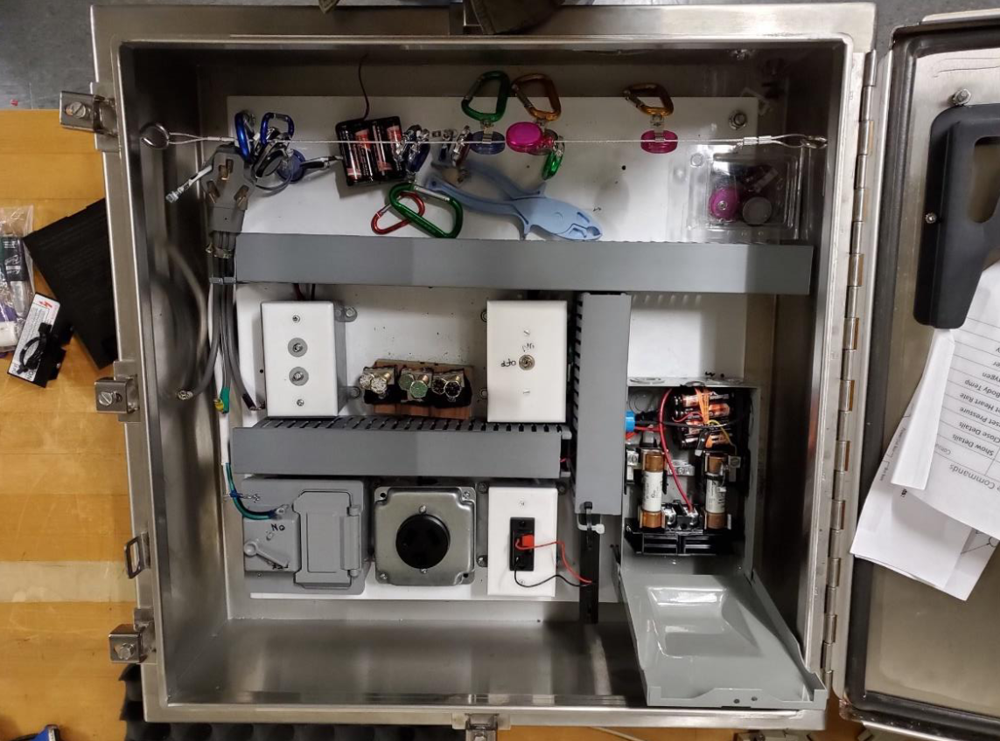
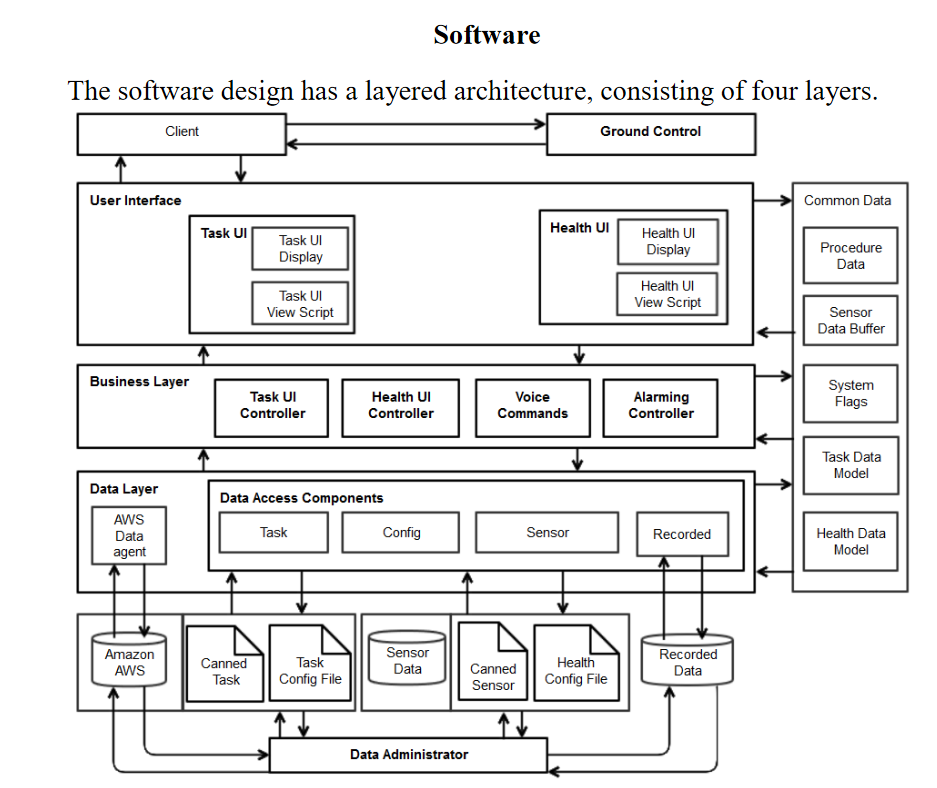

# Data-Visualization-in-Augmented-Reality
The NASA Spacesuit User Interface Technologies for Students (NASA S.U.I.T.S.) 2018 design challenge was an opportunity for student groups to be involved in the design of the new spacesuit. This challenge focused on designing the informatics system of the suit Heads Up Display (HUD) using the Microsoft HoloLens® to simulate this environment. The system was responsible for displaying the needed information to successfully complete an EVA. The project was developed using the Unity game engine with a HoloLens as the target platform to simulate the HUD. 

IDE: Visual Studio 2017 express edition  
Tool Kit: HoloToolkit V2017.2  
Unity Version: 2017.2.1f1  
Platform: Microsoft HoloLens V1 AR headset  
Playthrough: https://www.youtube.com/watch?v=r8QDdMbA4-w  

The project recreates NASA’s EVA task board to test our system. Subjects are
asked to step through two procedures. They are to pull a bad fuse and reroute the power
on the board. This includes steps like locating objects of interest on the task board and
interacting with them to complete the procedure.  
  

Some of the task steps required tools. There is a fuse puller, backup battery packs,
and power cables for rerouting power. The subjects were asked to wear gloves to mimic
16 the environment that an astronaut works in. In an EVA, an astronaut cannot work with
their bare hands, reducing their refined motor controls and their sense of touch.  
  

 
There is a shared layer to the architecture called the common data layer. This
stores flags and configuration information about the system. The UI layer reads the data
in this area to update the display. The business layer changes the flags and current data of
the system in this layer, based on events from the UI layer. It also monitors the ranges of
the data for the alarming system. The business layer instructs the data layer to populate
the common data based on the configuration of the system.  
    
The data access layer has several modules for receiving and converting data into
objects; the system understands and defines the definitions of these objects. The system
can retrieve data from Amazon Web Services in the form of a JSON file. There are also
modules for reading .csv files and getting data from a local SQL server database. This
layer receives instruction from the business layer to read and write into the common data.
This layer also logs the results of the experiment in .csv files.  
    
The business layer acts as a middleman to the data access layer and user interface
layer. Based on the configuration of the system, it tells the data layer where to pull
information for the experiment, and where to store it in the common data. This layer also
handles the event requests from the UI layer above it. The business layer controls the
state of the system and sets/clears flags as events occur. It monitors the ranges of values
for the consumables display and sets warnings and alarms when the values go out of
range. This layer handles the procedure creation and navigation, sending information to
the text-to-speech system, and sets flags to turn holograms on and off.  
    
The user interface level renders the current state of the system. The business layer
sets the current values in the common data, and the user interface reads these values and
displays them in a meaningful way. This interface has the concept of a HUD interface
where the instructions for the procedure and consumable values are displayed at a fixed
point relative to the headset’s orientation, displaying fixed holograms in the 3D
environment the subject is working in. The consumable interface has two versions to
display the same data. The display to be used is chosen when the program is launched.
These two types included a sprocket version that shrank as values decreased and grew as
they increased. When these values went out of range, the colors would change from green
to yellow for cautions, and then change to red for warnings.  
    
